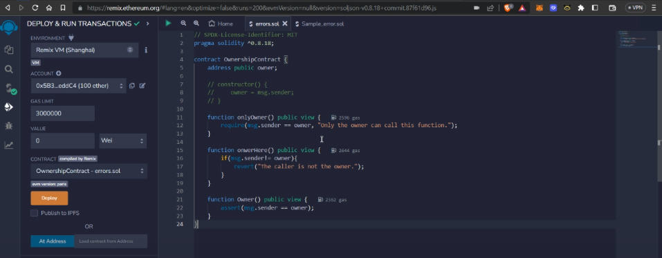

# ExampleContract - Smart Contract in Solidity

This is an example Solidity smart contract named `ExampleContract`. It demonstrates basic functionality, access control, and validation in a decentralized application (DApp) using the Ethereum blockchain.

## Features

- **Access Control:** Utilizes the `onlyOwner` modifier to restrict certain functions to be callable only by the owner of the contract.
- **Value Setting:** Provides a function `setValue` to update the `value` variable, subject to conditions and access control.
- **Validation:** Enforces conditions such as a positive new value and avoiding the value of 42.
- **License:** This contract is released under the MIT License.

## Installation

To deploy and interact with this smart contract, you'll need an Ethereum development environment. You can use tools like [Remix](https://remix.ethereum.org/) or [Truffle](https://www.trufflesuite.com/) for development and testing.

### Prerequisites

- Solidity Compiler (0.8.0)
- Ethereum Development Environment

## Getting Started

1. Clone this repository:

```bash
git clone https://github.com/your-username/your-repo.git
cd your-repo
```
# Output

